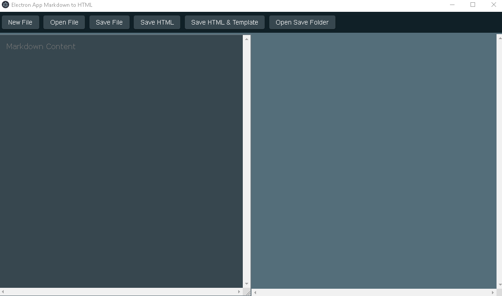
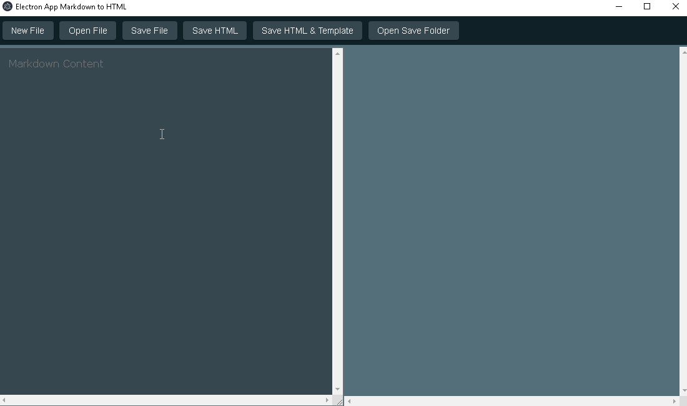
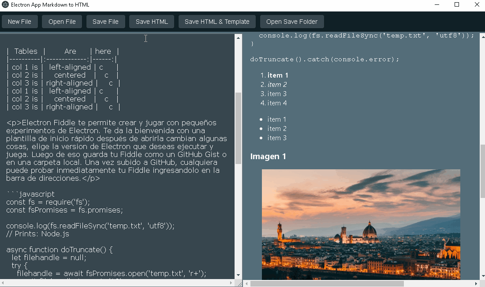
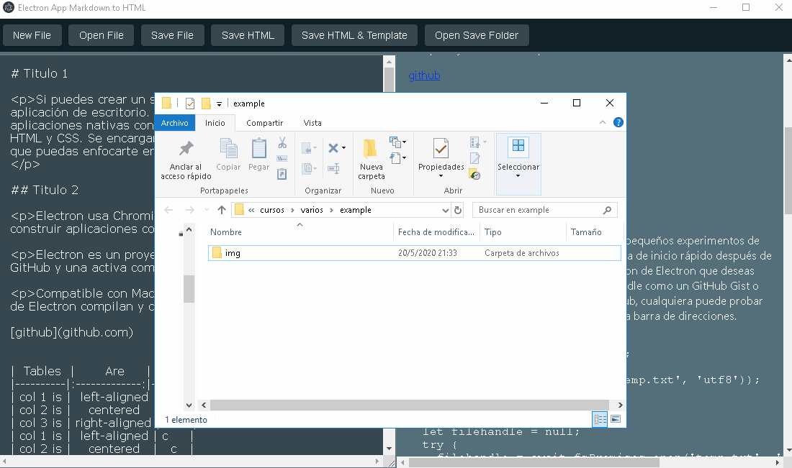
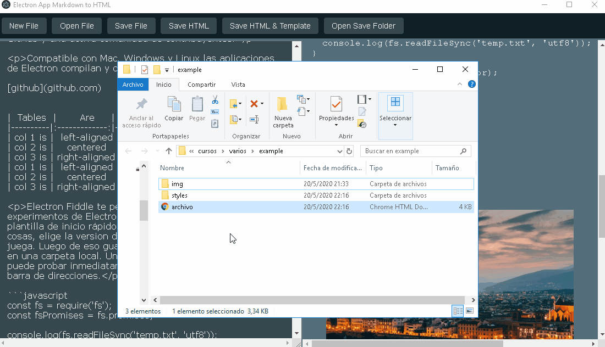

# 1. Convertidor de Markdown a HTML
Este proyecto trata de una aplicación en _Electrón_ que convierte texto de _Markdown_ a _HTML_.

<center>

</center>
 
- [1. Convertidor de Markdown a HTML](#1-convertidor-de-markdown-a-html)
  - [1.1. Instalación y configuración del proyecto](#11-instalación-y-configuración-del-proyecto)
  - [1.2. Implementación de la aplicación](#12-implementación-de-la-aplicación)
  - [1.3. Módigo para convertir de Markdown a HTML](#13-módigo-para-convertir-de-markdown-a-html)
  - [1.4. Reload en entorno de desarrollo](#14-reload-en-entorno-de-desarrollo)
  - [1.5. Usar template HTML](#15-usar-template-html)
  - [1.6. Usar sanitize](#16-usar-sanitize)
  - [1.7. Seguridad](#17-seguridad)
  - [1.8. Ignorar carpetas y archivos en electron-reload](#18-ignorar-carpetas-y-archivos-en-electron-reload)
  - [1.9. Estilo del archivo html creado](#19-estilo-del-archivo-html-creado)
  - [1.10. Crear instalador](#110-crear-instalador)
  - [1.11. Screenshots](#111-screenshots)
    - [1.11.1. simulación](#1111-simulación)
      - [1.11.1.1. Simulación inicial](#11111-simulación-inicial)
      - [1.11.1.2. Simulación del botón open](#11112-simulación-del-botón-open)
      - [1.11.1.3. Simulación de guardar el archivo html](#11113-simulación-de-guardar-el-archivo-html)
      - [1.11.1.4. Simulación de guardar el archivo Markdown](#11114-simulación-de-guardar-el-archivo-markdown)
      - [1.11.1.5. Simulación de guardar con template](#11115-simulación-de-guardar-con-template)
      - [1.11.1.6. Simulación de abrir el archivo con template](#11116-simulación-de-abrir-el-archivo-con-template)
  - [Repositorio](#repositorio)


## 1.1. Instalación y configuración del proyecto

1. Usaremos el editor _Visual Studio Code_, abrimos una nueva terminal dentro del editor `Ctrl + Shift + ñ` o `Terminal > New Terminal`.
2. Iniciar un proyecto de _node_ en la terminal ejecutamos:

```sh
npm init -y
```
Esto creará un archivo package.json.

3. Crear una carpeta llamada _app_ que contendrá el código de la aplicación.

4. Instalar _Electron_ para nuestra aplicación.

```sh
npm install electron
```

5. Crear el archivo _main.js_ dentro de la carpeta _app_.

6. Para ejecutar con _Electron_ modificamos el _package.json_. Dentro de _script_ creamos uno llamado _start_ que ejecutará el proyecto con _electron_. Además, en _main_ colocamos donde se encuentra el archivo principal.

```json
"main": "app/main.js",
  "scripts": {
    "start": "electron ."
  },
```

La aplicación se ejecutará con:

```sh
npm start
```

## 1.2. Implementación de la aplicación

Modificaremos el archivo _main.js_ que implementará toda la aplicación.

1. Importar _app_ y _BrowserWindow_ de _electron_ el uno es el origen de la aplicación y el otro una ventana de navegadores.

```javascript
const {app, BrowserWindow} = require('electron');
```

2. Creamos los archivos _renderer.js_, _index.html_ y _styles.css_ dentro de la carpeta _app_.

3. Modificamos el _index.html_, creamos un contenido _html5_ y dentro de _body_ colocamos el contenido con el que vamos a trabajar.

```html
    <section class="content">
        <!--<label for="markdown" hidden>Markdown Content</label> -->
        <textarea id="markdown" class="raw-markdown"></textarea>
        <div class="rendered-html" id="html"></div>
    </section>
```

4. Modificar el estilo en _styles.css_

```css
*, *::before, *::after{
    box-sizing: border-box; /* sumar el padding y margin de todos los elementos e ir calculando para todos los elementos*/
}

html, body {
    height: 100%;    
    width: 100%;
    overflow: hidden; /*sin barra lateral*/  
}

body {
    padding: 0;
    margin: 0;
    position: absolute;
}

body, input, textarea {
    font: menu; /*estilo por defecto del sistema operativo*/

}

textarea, input, div, button { /*sirve en ciertos sistemas operativos le colocan un borde por defecto*/
    outline: none; 
    margin: 0;
}

.content {
    height: 100vh;
    display: flex; /* hacer uso de flexbox para dividir la pantalla luego*/
}

.raw-markdown, .rendered-html {
    min-height: 100%;
    max-width: 50%; /*dividir la pantalla*/
    flex-grow: 1;
    overflow: scroll; /*barra lateral*/
    font-size: 16px;
}

.raw-markdown {
    border: 5px solid #ddd5d5;
    background-color: #ddd5d5;
    font-family: monospace;
}
```

5. Activar la integración de los módulos de **node** con la aplicación, dentro de _main.js_.

```javascript
mainWindow = new BrowserWindow({
        webPreferences: {
            nodeIntegration: true
        }
    });
```

## 1.3. Módigo para convertir de Markdown a HTML

Usaremos el módulo [marked](https://www.npmjs.com/package/marked)

1. Instalar marked con _node_.

```sh
npm install marked
```

2. Importamos el módulo a nuestro _renderer.js_

```javascript
const marked = require('marked');
```

3. Usamos marked para convertir lo que se obtiene del elemento de entrada, además, usamos _sanitize: true_ para limpiar el código que no es válido.

```javascript
const renderToMarkdown = (markdown) => {
    htmlView.innerHTML = marked(markdown, {sanitize: true});
}
```

## 1.4. Reload en entorno de desarrollo

```sh
npm install electron-reload
```

En _main.js_

```javascript
//reload entrono de desarrollo
if (process.env.NODE_ENV !== 'production'){
    require('electron-reload')(__dirname, {

    })    
}
```

## 1.5. Usar template HTML

1. Instalar [ejs](https://github.com/mde/ejs) para usar un template con JavaScript.

```sh
npm install ejs
```


## 1.6. Usar sanitize

Marked no sanitiza la salida HTML, recomiendan usar la librería [DOMPurify](https://github.com/cure53/DOMPurify). 

1. Instalar.
   
```sh
npm install dompurify
npm install jsdom
```

2. Se importa la librería.
```javascript
//sanitize
const createDOMPurify = require('dompurify');
```
3. Usamos para limpiar los datos.
```javascript
const renderToMarkdown = (markdown) => {
    const window1 = new JSDOM('').window;
    const DOMPurify = createDOMPurify(window1);     

    var dirty = marked(markdown); //convirtiendo a markdown
    const clean = DOMPurify.sanitize(dirty); //limpieza
    htmlView.innerHTML = marked(clean); //mostrando markdown en html
}
```

## 1.7. Seguridad

1. Por cuestiones de seguridad frente a ataques _XSS_ es muy recomendable no integrar Node en el _webPreferences_ de _main.js_ tendremos que modificarlo con:

```javascript
const path = require('path');

webPreferences: {            
            nodeIntegration: false,
            preload: path.join(__dirname, 'preload.js')
        }
```
2. En el mismo directorio de _main.js_ creamos el archivo _preload.js_ con la configuración:

```javascript
//preload.js
// All of the Node.js APIs are available in the preload process.
// It has the same sandbox as a Chrome extension.
window.addEventListener('DOMContentLoaded', () => {
  const replaceText = (selector, text) => {
    const element = document.getElementById(selector)
    if (element) element.innerText = text
  }

  for (const type of ['chrome', 'node', 'electron']) {
    replaceText(`${type}-version`, process.versions[type])
  }
})
```

3. Además, dentro de _preload.js_ se deberían importar y generar los módulos de _node_ que se harán uso con las funciones de implementación. La importación de un módulo externo a _electron_ se debería importarse antecedido de _require('electron').remote._

Por ejemplo, en vez de importar _marked_ así:

```javascript
const marked = require('marked'); //don't work
```
Debería importarse así:

```javascript
const marked = require('electron').remote.require('marked'); //work
```
El inicio de _preload.js_ con los módulos que estamos utilizando quedaría así:

```javascript
//preload.js
const marked = require('electron').remote.require('marked'); 
const fs =  require('electron').remote.require('fs');
const path = require('electron').remote.require('path');
const ejs = require('electron').remote.require('ejs');
const createDOMPurify = require('electron').remote.require('dompurify');
const {JSDOM} = require('electron').remote.require('jsdom');
const shell = require('electron').shell;
```

4. En el __preload.js__ generamos las funciones que usaremos en _renderer.js_ por ejemplo el _marked_ quedará así:

```javascript
//preload.js
window.marked = function(markdown){ 
  return marked(markdown);
}
```

5. Esta función la usamos en el __renderer.js__ de la siguiente manera.

```javascript
//renderer.js
const marked = window.marked; //importar la funcion de preload.js

const renderToMarkdown = (markdown) => {
    var dirty = marked(markdown);
    const clean = createDOMPurify(dirty); //limpieza
    htmlView.innerHTML = marked(clean); //mostrando markdown en html
}
```

Note la manera de declarar marked antecedido de _window_, así se hará con todos los demás.


6. Aumentar en el _head_ del _index.html_:

```html
<!-- https://developer.mozilla.org/en-US/docs/Web/HTTP/CSP -->
    <meta http-equiv="Content-Security-Policy" content="default-src 'self'; script-src 'nonce-23fcda896c'; font-src 'self' data:; img-src 'self' data:; ">    
    <meta http-equiv="X-Content-Security-Policy" content="default-src 'self'; script-src 'self'">
```

Note el _script-src 'nonce-23fcda896c'_ puedes colocar otros caracteres alfanuméricos o generar un hash, puedes revisar una información más detallada en el [sitio web de mozilla](https://developer.mozilla.org/en-US/docs/Web/HTTP/Headers/Content-Security-Policy/script-src#Unsafe_inline_script)

Esto lo usaremos para colcar el identificador en el script que hará referencia a nuestro _renderer.js_

```html

    <script src="renderer.js" nonce="23fcda896c">
    </script>
</body>
```

7. El _preload.js_ para archivos de electron es un poco diferente, por ejemplo con _dialog_ y _shell_


```javascript
const { dialog } = require('electron').remote;
const {shell} = require('electron').remote;
window.electron = {};
window.electron.dialog = dialog;
window.electron.shell = shell;
```

En el _renderer.js_:

```javascript
const dialog = window.electron.dialog;
const shell = window.electron.shell;
```

Si las funciones como _fs_ ya están implementadas en _renderer.js_ se podría solucionar agregando la siguiente línea en _preload.js_

```javascript
window.fs = fs;
```

8. Si existe problemas con **__dirname** diciendo que está indefinido se deberá agregar a _renderer.js_:

```javascript
//agregado renderer        
    __dirname = path.resolve();
//o otras alternativas:
/*
__dirname = process.cwd();
__dirname = fs.realpathSync('.');
__dirname = process.env.PWD
*/
```

## 1.8. Ignorar carpetas y archivos en electron-reload

El módulo _electron-reload_ es usado principalmente en entorno de desarrollo, nos sirve para recargar la aplicación cada vez que efectuemos un cambio en nuestro código o aplicación. Sin embargo, necesitamos modificar otras carpetas o archivos dentro de nuestra aplicación que no necesite recargar la aplicación nuevamente. Por ejemplo, cuando guardamos archivos dentro de nuestra app. Para esto haremos uso de la opcion **{ignored: /node_modules|[\/\\]\./, argv: []}.** que por defecto es así. 

1. Ahora dentro de _main.js_ crearemos expresiones regulares de los directorios con los archivos o carpetas que deseamos ignorar.

```javascript
const ignoredNode = /node_modules|[/\\]\./;
const ignored1 = /files|[/\\]\./; //file => files
const ignored2 = /app\/files|[/\\]\./; //file => app/files
const ignored3 = /app\/img|[/\\]\./; //file => app/img
```
2. Agregamos a la configuración de _electron-reload_ como se observa.

```javascript
if (process.env.NODE_ENV !== 'production'){
   /* require('electron-reload')(__dirname, { }) */
    require('electron-reload')(__dirname, {ignored: [ignored1, ignored2, ignored3, ignoredNode] });    
}
```
Estamos ignorando los módulos de node, y los directorios "/app/files" y "/img".


## 1.9. Estilo del archivo html creado
Para el estilo de la etiqueta `<code>` usaremos [Prismjs](https://prismjs.com), escojemos el tema que deseamos descargar y para que lenguajes, esto le dará un buen estilo al código que estará dentro la etiqueta `<code>`.
Descargamos los dos archivos `.js` y `.css`.


1. Instalar `fs-extra` para poder copiar carpetas.

```javascript
npm install fs-extra
```

2. Agregar en la cabecera del template:
   
```html
<head>
    <link rel="stylesheet" href="./styles/styles_template.css">
    <link rel="stylesheet" href="./styles/prism.css">
```

3. Agregar al final de body.

```html
    <script src="./styles/prism.js"></script>
</body>
```
4. Importar `fs-extra` en el `preload.js`

```javascript
const fse =  require('electron').remote.require('fs-extra'); 
window.fse = fse;
```

5. Importar para uso en `renderer.js`

```javascript
const fse = window.fse;
```

6. En el `renderer.js` crear el método para copiar los directorios que contienen los estilos usados en el template.

```javascript
function copyStylesDirectory(filePath){
    var pathSource = path.join(__dirname, 'app/resources/styles');

    var nameFileDirectory = path.dirname(filePath); //directorio del archivo destino    
    var pathDestination = path.join(nameFileDirectory, "styles"); //se creará la carpeta style en el destino  
    // if folder doesn't exists create it
    if (!fs.existsSync(pathDestination)){
    fs.mkdirSync(pathDestination, { recursive: true });
    }

    fse.copy(pathSource, pathDestination, function (err) {
        (err) ? console.error("error copy directory:"+ err) : console.log("success copy directory!");
    });
}
```

## 1.10. Crear instalador

Haremos uso del módulo [electron-packager](https://github.com/electron/electron-packager)

Electron Packager se ejecuta sobre las siguientes plataformas de **host**:

* Windows (32/64 bit)
* macOS (formerly known as OS X)
* Linux (x86/x86_64)

Genera ejecutables para las siguientes plataformas:

* Windows (conocido también como win32 para las arquitecturas de x86, x86_64, y arm64)
* macOS (conocido como darwin) / Mac App Store (también conocido como mas)*
* Linux (para arquitecturas x86, x86_64, armv7l, arm64, and mips64el)

**Nota** para los paquetes de destino de `macOS/Mac App Store`: el paquete `.app` solo se puede firmar cuando se construye en una plataforma host de `macOS`.

1. Para crear un archivo ejecutable debemos instalar el módulo ` electron-packager`. La opción `-g` instala de manera global.

```console
npm install -g electron-packager
```
2. Ingresamos al directorio de nuestra aplicación.

El siguiente comando es la forma básica para crear el ejecutable

```console
electron-packager <sourcedir> <appname> --platform=<platform> --arch=<arch> [optional flags...]
```
`--platform` y `--arch` pueden ser omitidos en dos casos:

* Si tú especificas `--all` Se crearán paquetes para todas las combinaciones válidas de plataformas oarquitecturas de destino.

* De lo contrario, se creará un paquete único para la plataforma o arquitectura del host.

Si se omite `appname,` se usará el nombre especificado por "productName" o "name" en el package.json más cercano.

3. Crear el ejecutable según la plataforma:

* Para MacOS:

```console
electron-packager . --overwrite --platform=darwin --arch=x64 --icon=assets/icons/mac/icon.icns --prune=true --out=release-builds
```
* Para Linux:

```console
electron-packager . electron-tutorial-app --overwrite --asar=true --platform=linux --arch=x64 --icon=assets/icons/png/1024x1024.png --prune=true --out=release-builds
```
* Para Windows:

```console
electron-packager . electron-tutorial-app --overwrite --asar=true --platform=win32 --arch=ia32 --icon=assets/icons/win/icon.ico --prune=true --out=release-builds --version-string.CompanyName=CE --version-string.FileDescription=CE --version-string.ProductName="Electron Tutorial App"
```

Usaremos el siguiente comando

```console
electron-packager . --platform=win32 --arch=x64 --icon=resorces/icons/icon_app.ico
```
4. Si todo ha salido bien se ha creado una carpeta que contiene el ejecutable de nuestro proyecto.
<center>

</center>


## 1.11. Screenshots

### 1.11.1. simulación 

#### 1.11.1.1. Simulación inicial

<center>

</center>

#### 1.11.1.2. Simulación del botón open

<center>

</center>


#### 1.11.1.3. Simulación de guardar el archivo html

<center>

</center>

#### 1.11.1.4. Simulación de guardar el archivo Markdown

<center>

</center>

#### 1.11.1.5. Simulación de guardar con template

<center>

</center>

#### 1.11.1.6. Simulación de abrir el archivo con template

<center>

</center>

## Repositorio

[GitHub](https://github.com/diegodavidQ/Electronjs_Markdown_to_HTML)